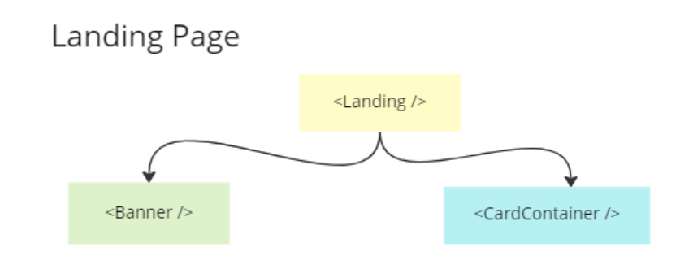
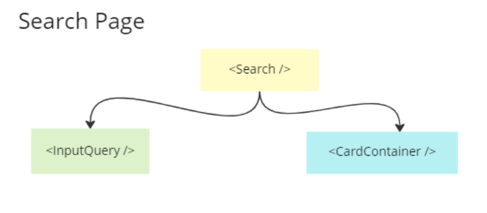

# Tradera

The frontend for project #6 in the TietoEvry Java Course.

# About

This is a frontend part of Tradera project 

# Installation

#0 Clone the repository
#0 Open a terminal and type `npm install` inside the repository folder
#0 Run `npm start` to open the project in `localhost:3000`

# Organization

This is a complex project, thus here are some hierarchy diagrams to understand the project structure.

# Starting Point Component

The entry point is `App.tsx`.

# Project folder structure inside src folder

## 1. assets

This folder contains all required images, logos and icons for project.

## 2. components

This folder contains files for child components that are connected to parnet components present inside page folder.

## 3. data

This folder contains json files for navbar and routing components. 

## 4. interfaces

This folder contains files for typescript interface code.

## 5. pages

This folder contains main components or in other words parent component that are acting as pages when used in routing component.

## 6. routes

This folder contains all code related to routing.

## 7. scripts 

This folder contains code for image resizing and other stuff related to it. 

## 8. services

This folder contains classes files that contains functions related to bidding, bidding end data and fetching required data from backend for successfull bidding.

## 9. styles

This folder contains all css styling files for this project

# Page component deatils

## 1. Landing Page

This page component contains 
    
    1. Banner component which displays a banner with searchbar so that a user can search required products.
    2. Card container which displays all available products in our database.

## 2. LoginScreen

This page component handles login functionalities for our frontend project.

## 3. NewAd

This page component contains all code related to creating a new product ad for tradera site.

## 4. Search

This page component contains all code related to search product functionality and displaying search results. 

## 5. SigUpScreen

This page component contains all code related to sign up. 

## 6. SingleProdcut

This page component is a parent component of SingleProductCard component which handles the code related to 

1. Getting the highest bid from backend otherwise display the asking price as current highest bid.
2. Date comparison functionalities related to checking bidding expiry date.
3. Code related to bidding and allowing user if bidding is still open or closed according to closing time.
4. Displaying the winner id incase of bidding close.
5. This component use other components inside services folder for fetching the required data for example bidding data, user data, creating a new bid and all required functionalities mentioned above.